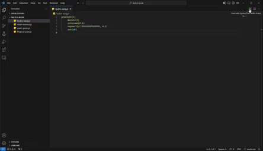

# 🧩 Hydra Live Code



Extension for live coding with the [Hydra](https://hydra.ojack.xyz/) video synthesizer in Visual Studio Code and its forks.

## Status

Version 0.4.x is the last release of the standalone webview-only plugin. Version 1.0 (in development) migrates to the [Rig](https://github.com/jdomizz/rig) framework and supports an external browser runtime for camera/audio/MIDI. See the [migration spec](.opencode/specs/backlog/rig-plugin-rewrite.md) and the [program roadmap](https://github.com/jdomizz/vscode-hydra/blob/main/.opencode/specs/roadmap.md) for details.

## Features

- Supports live coding with Hydra and JavaScript in general.
- Supports loading Hydra [extensions](https://github.com/hydra-synth/hydra-extensions) and external JavaScript libraries.
- Supports [OSC](https://opensoundcontrol.stanford.edu/) communication.
- Includes [p5.js](https://p5js.org).

You can see a demo project with examples [here](https://github.com/jdomizz/vscode-hydra/tree/main/demo).

## Install

- [Visual Studio Marketplace](https://marketplace.visualstudio.com/items?itemName=jdomizz.vscode-hydra)
- [Open VSX Registry](https://open-vsx.org/extension/jdomizz/vscode-hydra)
- [VSIX file](https://github.com/jdomizz/vscode-hydra/releases)

## Commands

- `Ctrl/Cmd + Shift + Enter`: Eval the active JavaScript document.
- `Ctrl/Cmd + Alt + Enter`: Eval a line (or a selection) of code.
- `Alt + Enter`: Eval a block of code.
- `Ctrl/Cmd + Shift + S`: Take a screenshot of the canvas.
- `Ctrl/Cmd + Shift + V`: Start or stop video recording the canvas.

## Settings

* `jdomizz.vscode-hydra.width`: Set the width of the canvas.
* `jdomizz.vscode-hydra.height`: Set the height of the canvas.
* `jdomizz.vscode-hydra.loadScripts`: Set the list of scripts to be loaded at startup.

## Scripts

Hydra [extensions](https://github.com/hydra-synth/hydra-extensions) and external JavaScript libraries can be loaded using Hydra's `loadScript` function or via the `jdomizz.vscode-hydra.loadScripts` configuration option:

```json
{
    "jdomizz.vscode-hydra.loadScripts": [
        "https://unpkg.com/tone",
        "https://hyper-hydra.glitch.me/hydra-gif.js",
    ]
}
```

## Architecture

The plugin ships two rendering paths:

- **Webview** — a contained quick-preview panel embedded in VS Code. Renders Hydra but cannot access camera, microphone, screen capture, or MIDI (VS Code's webview permission policy blocks `getUserMedia` and WebMIDI — see [microsoft/vscode#250568](https://github.com/microsoft/vscode/issues/250568)).
- **Sweep mode** — spawns an external browser pointing at a `canvas.html` page. This path has full device access (camera, audio, MIDI) because it runs in a real browser, outside VS Code's sandbox.

Version 1.0 formalizes this pattern: the webview becomes a contained quick-preview, and the external browser runtime becomes the primary render surface — powered by the [Rig](https://github.com/jdomizz/rig) framework.

## OSC

Open Sound Control is provided by [osc-js](https://adzialocha.github.io/osc-js/) in bridge mode. It has been configured as follows:

- Port `41234` is for _sending_ messages
- Port `41235` is for _receiving_ messages

Use the `OSC` object to send and receive messages:

```js
OSC.send('/test', value)

OSC.on('/test', (args) => { /* do something with args */ })
```

Note you can also open and close connections:

```js
OSC.open({ host: '127.0.0.1', port: 8080 })

OSC.close()
```

## p5.js

This extension includes the same wrapper for [p5.js](https://p5js.org) as the Hydra web editor. You can check how to use it in the Hydra [documentacion](https://hydra.ojack.xyz/docs/docs/learning/extending-hydra/extending-hydra/#p5js).

## Assets

Install the [Live Server](https://marketplace.visualstudio.com/items?itemName=ritwickdey.LiveServer) extension to serve assets from your project folder. This way you can use local images and videos.

```js
s0.initImage('http://localhost:5500/image/hydra.jpg')
```

## Issues

Microphones, webcams, screen capture and MIDI do not work inside the webview due to the Visual Studio Code permissions policy (see [Architecture](#architecture)). Version 1.0 will support these devices via an external browser runtime.
If you detect any other problem, please [open an issue](https://github.com/jdomizz/vscode-hydra/issues).

## License

Distributed under the GNU Affero General Public License.

